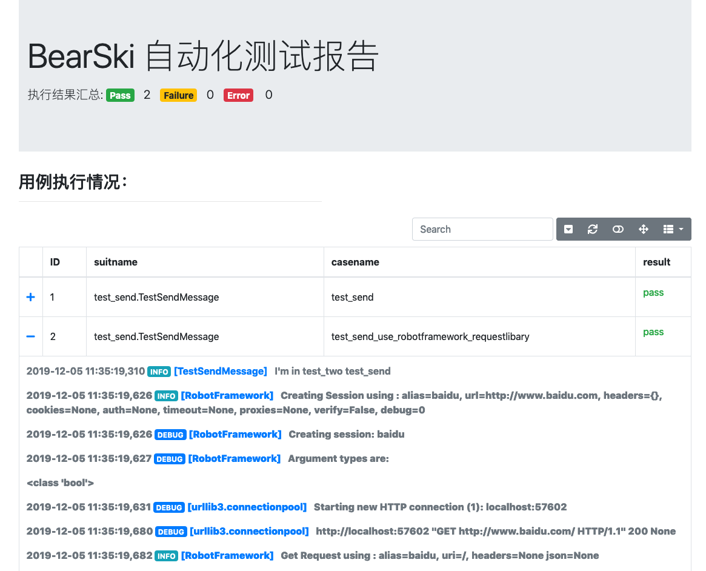
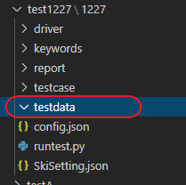
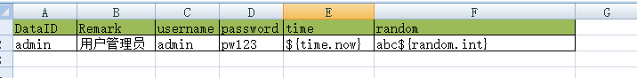
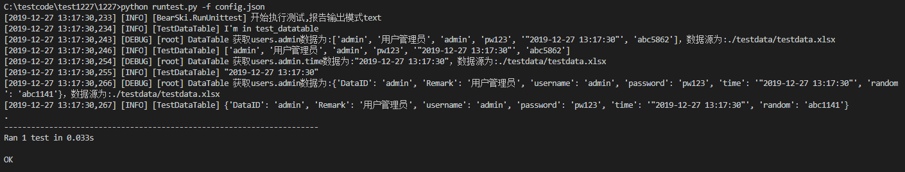
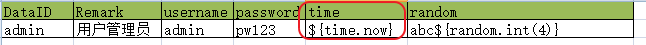
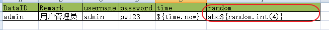

# BearSki 测试框架使用指南

## 简介
BearSki 是一个自动化测试的基础框架。提供项目在自动化测试应用中遇到的一些通用问题的解决方案。降低测试用例编写难度，提升自动化测试用例的可维护性。

## 快速开始
1、安装
```bash
pip install BearSki
```
2、生成测试项目
```bash
siriusdeMacBook:src sirius$ python
Python 3.6.0 |Anaconda 4.3.0 (x86_64)| (default, Dec 23 2016, 13:19:00) 
[GCC 4.2.1 Compatible Apple LLVM 6.0 (clang-600.0.57)] on darwin
Type "help", "copyright", "credits" or "license" for more information.
>>> from BearSki import Manager
>>> Manager.create_project('testproject')
[2019-12-05 11:34:42,731] [INFO] [BearSki.createproject] 开始创建测试项目
[2019-12-05 11:34:42,734] [INFO] [BearSki.createproject] 测试项目创建完成
>>> exit()
```
3、控制台输出模式执行用例
```bash
src sirius$ cd testproject
testproject sirius$ python runtest.py 
```
4、测试报告模式执行用例
```bash
testproject sirius$ python runtest.py -f config.json
```
5、查看测试报告




## 用户指南

### 创建测试用例
### 创建关键字
### 执行测试用例
### 使用数据表
#### 依赖包
```
>pip install openpyxl
```

1、创建测试项目
``` shell
C:\testcode\test1227>python
Python 3.6.8 (tags/v3.6.8:3c6b436a57, Dec 24 2018, 00:16:47) [MSC v.1916 64 bit (AMD64)] on win32
Type "help", "copyright", "credits" or "license" for more information.
>>> from BearSki import Manager
>>> Manager.create_project("1227")
完成测试项目创建：1227
```
2、进入项目目录下创建 测试数据文件夹 testdata 如下图：



3、创建一个数据表（excel）


###在用例中使用测试数据中调用数据表
    
* 1、配置SkiSetting.json ,db_type ：数据源类型，db_path 数据文件路径

``` json
"datatable":{
        "db_type":"excel",
        "db_path":"./testdata/testdata.xlsx"
    }
```
* 2、创建用例

在测试用例中引用，DT类 datatable缩写

``` python
from BearSki.base import DT

```


``` python


# coding=utf-8
import time
import unittest
from BearSki.base import Ski
from BearSki.base import DT
import logging
class TestDataTable(unittest.TestCase,Ski):
    def setUp(self):
        self.logger=logging.getLogger('TestDataTable')
    def tearDown(self):
        pass
    @Ski.case()
    def test_datatable(self):
        self.logger.info("I'm in test_datatable")
        # 获取一行数据
        self.logger.info(DT("users.admin").list())
        # 获取一个数据
        self.logger.info(DT("users.admin.time").list())
        self.logger.info(DT("users.admin").json())
     
```

3、数据表数据调用 

用例执行结果


* 获取一行数据
``` python
 DT("users.admin").list()
```
* 获取 一个单元格数据：
``` python
 DT("users.admin.time").list()
```
* 获取 json格式返回值：
``` python
 DT("users.admin").json()
```
* 自动获取当前时间



* 获取整数型随机变量
说明，括号中的 数字为随机的位数 如：随机5位整数 ${random.int(5)}


## 交流与反馈
项目地址：https://github.com/Sirius1942/BearSki
邮箱：chen6_9@163.com 或在github上直接题问题单


